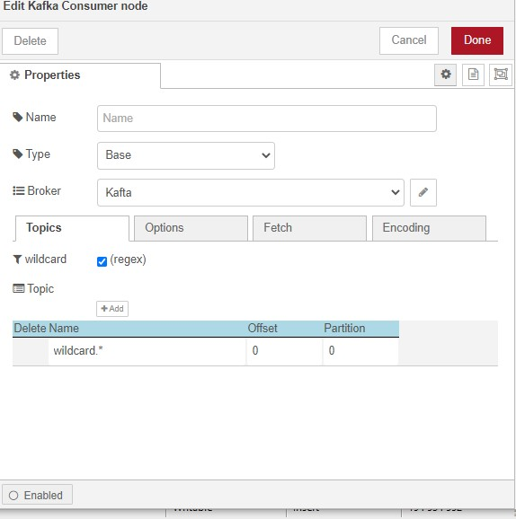

# [node-red-contrib-kafka-manager][2]
[Node Red][1] for working with apache kafka, a streaming product.
First initial release using [kafka-node][4] .

* Kafka Broker
* Kafka Admin
* Kafka Commit
* Kafka Consumer
* Kafka ConsumerGroup
* Kafka Offset
* Kafka Producer
* Kafka Rollback

Has a test GUI which allows topics to be added.

Special features:
* Generic topic(s) for a consumer using regex which dynamically adds new topics as they are defined
* For consumer add/remove topics (not persisted)
* Convert "/" to "." to assist with interfaces to other queueing technologies

Note: all nodes run in debug mode for 111 messages then turns off.

------------------------------------------------------------

## Kafka Broker

Defines the client interface to kafka. One can add process.env for hosts with 

	process.env.atesthosts='[{"host":"atesthost1","port":1234},{"host":"atesthost2","port":4321}]';

in settings.js

------------------------------------------------------------

## Kafka Admin

Provide the ability to process administration tasks such as create and list topic. 

Following topics commnads or via GUI allowed:

*   describeCluster
*   describeDelegationToken
*   describeReplicaLogDirs
*   listConsumerGroups
*   listGroups
*   listTopics

Plus following topics commands allowed where paramaters are payload:
*   alterConfigs, alterReplicaLogDirs, createAcls,createDelegationToke
*   createPartitions, createTopics, deleteAcls, deleteConsumerGroups, deleteRecords
*   deleteTopics, describeAcls, describeConsumerGroups, describeGroups, describeLogDirs, describeTopics   *   electPreferredLeaders, expireDelegationToken, incrementalAlterConfigs, listConsumerGroupOffsets, renewDelegationToken

------------------------------------------------------------

## Kafka Commit

If msg._kafka exists and the consumer associated with the message is not on autocommit, it issues commit for the consumer that had produced the message.  Sends to OK or Error port depending on state.
Note, as Kakfa keeps giving messages to consumer regardless if commit being outstanding, the commit may commit many in-flight messages.  Haven't identified a method of readily preventing this behavour without complications.

------------------------------------------------------------

## Kafka Consumer

Consumer of topic messages in kafka which are generated into node-red message. 
Provides types of base and high level.
If wildcard selected then topics are regex patterns which are dynamically made active (or removed) when available.
A check is performed once every minute for chanaes to topics.

------------------------------------------------------------

## Kafka Consumer Group

Consumer of topic messages in kafka which are generated into node-red message. 

------------------------------------------------------------

## Kafka Offset

Get various offsets from Kafka. Which type are set via msg.action or msg.topic.  msg.payload states the types of options.

------------------------------------------------------------

## Kafka Producer

Converts a node-red message into a kafka messages.
Provides types of base and high level.

------------------------------------------------------------

## Kafka Rollback

If msg._kafka exists and the consumer associated with the message is not on autocommit, it closes the consumer.  This effectively rolls back the message in Kafka plus ensures the message cannot be automatically handed to the the consumer.  It is expected that the message or problem is fixed and the consumer opened again for processing.

------------------------------------------------------------

## Simple Web Admin Panel

Simple Web page monitor and admin panel 

------------------------------------------------------------

# Install

Run the following command in the root directory of your Node-RED install or via GUI install

    npm install node-red-contrib-kafka-manager

# Tests

Test/example flow in test/generalTest.json

------------------------------------------------------------

# Version

0.6.1 Major change in compression and add deadletter q

0.5.0 add consumer wildcard topics + topics / to . along with fix on to/from/json

# Author

[Peter Prib][3]

[1]: http://nodered.org "node-red home page"

[2]: https://www.npmjs.com/package/node-red-contrib-kafka-manager "source code"

[3]: https://github.com/peterprib "base github"

[4]: https://github.com/SOHU-Co/kafka-node "npm kafka-node"
